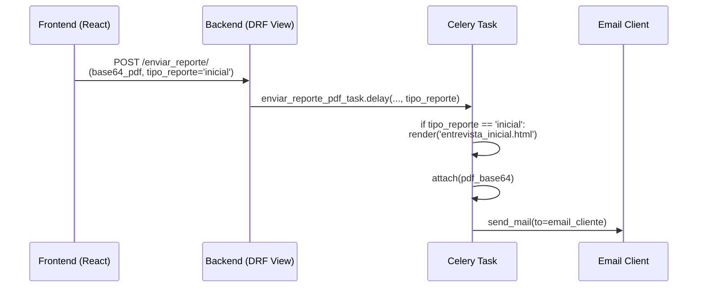

# Walkthrough: Arquitectura de Plantillas Dinámicas para Reportes PDF

**Fecha:** 17 de Agosto de 2026
**Módulo:** Reclutamiento (Atracción de Talento)
**Objetivo:** Permitir el envío de Reportes Ejecutivos en PDF al cliente, utilizando plantillas de correo HTML dinámicas y corporativas ("Premium"), dependiendo de si el reporte corresponde a una **Entrevista Inicial** o una **Entrevista Profunda**.

---

## 1. Arquitectura de la Solución

El flujo de envío de reportes funciona mediante una arquitectura asíncrona usando **React (Frontend)**, **Django REST Framework (Backend)** y **Celery (Workers)**.



## 2. Implementación en el Backend

### A. Tarea de Celery (`tasks.py`)
La tarea `enviar_reporte_pdf_task` fue modificada para recibir el parámetro opcional `tipo_reporte`. Dependiendo de este valor, la tarea selecciona la plantilla HTML correspondiente y la renderiza usando `render_to_string`.

> [!TIP]
> **Mejor Práctica:** Se utilizó un parámetro con valor por defecto `tipo_reporte="general"` para asegurar compatibilidad hacia atrás con cualquier parte del sistema que aún no envíe este nuevo parámetro.

### B. Vista DRF (`views.py`)
La vista `EnviarReporteEmailView` (método POST) se encarga de interceptar el payload del Frontend. Extrae la variable `request.data.get('tipo_reporte')` y la transfiere directamente como argumento final en la llamada `.delay()` de Celery.

### C. Plantillas HTML Corporativas (`templates/emails/`)
Se diseñaron dos plantillas exclusivas dirigidas al cliente, optimizadas para renderizado en Microsoft Outlook (uso de tablas, estilos inline, sin variables CSS modernas):
- `entrevista_inicial.html`: Texto enfocado en la presentación del perfilador inicial.
- `entrevista_profunda.html`: Texto enfocado en la presentación de la matriz de competencias y dictamen técnico final.

> [!IMPORTANT]
> Las plantillas incluyen campos dinámicos para `{{ candidato_nombre }}`, `{{ vacante_nombre }}`, `{{ mensaje_adicional }}` y `{{ reclutador_nombre }}`.

## 3. Implementación en el Frontend (React)

El componente `ModalEnviarReporte.jsx` se encarga de capturar el correo electrónico del cliente y un mensaje adicional opcional. La responsabilidad de despachar la petición de red recae en el componente padre (ej. `FlujoCandidato.jsx` o el Tablero ATS) a través de la propiedad `onSend`.

### Modificación Requerida en el Padre:
Al invocar la función `onSend` o al construir el payload para el endpoint, el desarrollador debe inyectar la variable `tipo_reporte`.

```javascript
// Ejemplo conceptual en el Componente Padre
const handleEnviarReporte = async ({ email, mensaje }) => {
    const payload = {
        email_cliente: email,
        candidato_nombre: candidato.nombre_completo,
        vacante_nombre: candidato.vacante_nombre,
        pdf_base64: pdfBase64Generado,
        mensaje_adicional: mensaje,
        tipo_reporte: 'inicial' // <-- Inyección de la variable clave
    };

    await fetchConToken('/reclutamiento/endpoint-de-envio/', {
        method: 'POST',
        body: JSON.stringify(payload)
    });
};
```

## 4. Criterios de Evaluación y Mantenimiento

- **Compatibilidad de Correo:** Si se requieren hacer ajustes estéticos a los colores (ej. `#1A237E` a otro color de marca), se debe reemplazar mediante buscar-y-reemplazar en el archivo HTML, manteniendo la propiedad `style=""` en línea.
- **Escalabilidad:** Si en el futuro surge un tercer tipo de entrevista (ej. Panel Gerencial), simplemente se debe agregar un nuevo `elif tipo_reporte == 'panel':` en `tasks.py` y crear su respectivo `panel_gerencial.html`.
