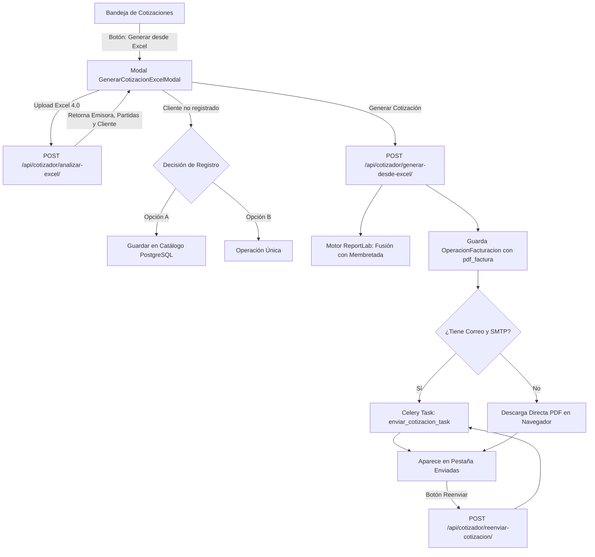

---
tags:
  - cotizador
  - arquitectura
  - backend
  - frontend
  - react
  - django
  - celery
  - docker
  - obsidian-second-brain
date: 2026-09-09
autor: Sistemas P&M
modulo: Modulo 5 - Cotizador y Facturacion Empresarial
---

# Walkthrough: Generador de Cotizaciones desde Excel en Bandeja, Reenvío y Purga de UI

## 1. Resumen Ejecutivo

En esta sesión se llevó a cabo una refactorización y consolidación funcional del **Módulo de Cotizaciones**:
1. **Fusión Operativa del Generador Excel:** Se eliminó la pestaña y el formulario independiente de "Generar Cotización" en el sidebar de `ModuloCotizador.jsx`, concentrando todo el flujo de generación oficial directamente en la **Bandeja de Cotizaciones** mediante un modal interactivo (`GenerarCotizacionExcelModal.jsx`).
2. **Detección Inteligente y Ruteo de Despacho:**
   - Si el cliente no existe en la BD, el sistema le permite al usuario elegir entre **"Guardar en Catálogo"** (registrando todos los datos fiscales extraídos del Excel) u **"Operación Única"** (en memoria).
   - Verificación proactiva de la empresa emisora: alertas visuales si falta la plantilla membretada física en disco (`media/membretadas/`) o si carece de credenciales SMTP.
   - Si hay correo de destino y SMTP, se despacha por Celery; si no, se descarga el PDF generado de inmediato en el navegador.
3. **Persistencia Física de PDFs de Cotización:** Ahora toda cotización generada desde Excel almacena su binario físico en el campo `pdf_factura` de `OperacionFacturacion` mediante `ContentFile`.
4. **Función de Reenvío en 1 Clic:** Se implementó el endpoint `/api/cotizador/reenviar-cotizacion/` y el botón de acción en la tabla de **Enviadas** para poder reenviar cualquier cotización con corrección instantánea de correo (sin tener que volver a subir el Excel si hubo un error tipográfico).
5. **Rediseño Espacioso (No Cramped):** Reestructuración visual del modal con un esquema en 2 columnas paralelas (Emisor / Receptor), selector de archivo y fecha unificados en la fila superior, badges de Lucide y código 100% libre de emojis.
6. **Diseño de la Nueva App `apps.agentes`:** Se planificó la creación de la nueva aplicación de Django `backend/apps/agentes/` como hub central de Inteligencia Artificial para el sistema (comenzando con el Agente Diagnóstico SMTP y el Agente Redactor de Incidentes).

---

## 2. Diagrama de Arquitectura y Flujo de Despacho



---

## 3. Cambios Implementados por Capa

### A. Backend (`apps/cotizador/`)

#### [views.py](file:///home/sistemas_pm/Proyectos/Sistema-Integral-de-Gestion/backend/apps/cotizador/views.py)
1. **Persistencia física del PDF:**
   ```python
   operacion = OperacionFacturacion.objects.create(
       tipo_operacion='COTIZACION',
       referencia_unica=folio,
       cliente=cliente,
       empresa_emisora=empresa,
       subtotal=subtotal_calc,
       impuestos=impuestos_calc,
       total=total_calc,
       datos_formulario=datos_form,
       cotizacion_enviada=True,
       creado_por=request.user if request.user.is_authenticated else None,
       pdf_factura=ContentFile(pdf_content, name=f"{folio}.pdf") # Persistencia física garantizada
   )
   ```
2. **Nueva Vista de Reenvío (`reenviar_cotizacion_view`):**
   - Valida la existencia de la operación y que cuente con su PDF físico almacenado en `pdf_factura`.
   - Lee el binario en base64 y actualiza el campo `correo_receptor` en `datos_formulario`.
   - Encola la tarea asíncrona `enviar_cotizacion_task` con el nuevo destinatario.

#### [urls.py](file:///home/sistemas_pm/Proyectos/Sistema-Integral-de-Gestion/backend/apps/cotizador/urls.py)
- Registro de ruta:
  ```python
  path('reenviar-cotizacion/', reenviar_cotizacion_view, name='reenviar-cotizacion'),
  ```

---

### B. Frontend (`src/components/cotizador/` y `src/pages/cotizador/`)

#### [GenerarCotizacionExcelModal.jsx](file:///home/sistemas_pm/Proyectos/Sistema-Integral-de-Gestion/frontend/src/components/cotizador/GenerarCotizacionExcelModal.jsx)
- **Grid en 2 Columnas:** Muestra en paralelo la tarjeta de Empresa Emisora y Cliente Receptor.
- **Selector de Fecha y Archivo Unificado:** Ahorra 100px verticales y elimina la sensación de cajas encimadas.
- **Tarjetas de Selección de Cliente:** Opciones *"Guardar en Catálogo"* y *"Operación Única"* representadas como tarjetas modernas con iconos profesionales de Lucide (`Database` y `FileText`).
- **Botón de Vista Previa:** Integrado con icono de ojo `Eye` y texto *"Vista Previa"*, permitiendo inspeccionar el PDF en una pestaña emergente antes de despachar.
- **Cero Emojis:** Se reemplazaron caracteres informativos por el componente `<Info size={14} />`.

#### [BandejaCotizaciones.jsx](file:///home/sistemas_pm/Proyectos/Sistema-Integral-de-Gestion/frontend/src/components/cotizador/BandejaCotizaciones.jsx)
- Botón morado **"Generar desde Excel"** en la cabecera principal.
- Función `handleReenviar(cot)` que solicita el nuevo correo mediante un cuadro de diálogo y llama a `/api/cotizador/reenviar-cotizacion/`.
- Botón morado con el icono `<Send size={16} />` en la columna de acciones de la tabla **Enviadas**.

#### [ModuloCotizador.jsx](file:///home/sistemas_pm/Proyectos/Sistema-Integral-de-Gestion/frontend/src/pages/cotizador/ModuloCotizador.jsx)
- Eliminación del botón "Generar Cotización" en el sidebar y drawer móvil.
- Eliminación del formulario residual y del modal viejo de confirmación de Excel.
- Pestaña inicial configurada por defecto en `'bandeja_cotizaciones'`.

---

## 4. Diagnóstico de Error Resuelto: Rebote SMTP 550

Durante las pruebas se detectó en los logs de Celery:
```text
Task apps.cotizador.tasks.enviar_cotizacion_task[...] succeeded in 1.78s: 
'Error al enviar correo: {\'contacto@raaledificac.com\': (550, b\'The mail server could not deliver mail to contacto@raaledificac.com. The account or domain may not exist...\')}'
```
- **Diagnóstico:** El servidor SMTP emisor rechazó la entrega porque el dominio `raaledificac.com` no existe en los DNS de Internet (error de dedo al omitir `iones`).
- **Resolución:** Con la nueva función de reenvío, el usuario puede hacer clic en el botón de reenvío de esa cotización, ingresar el correo correcto (ej. `compras@raal.mx`) y reenviarla de inmediato.

---

## 5. Próxima Fase: App `backend/apps/agentes/`

Se acordó estructurar el sistema multi-agente en una nueva app de Django llamada **`agentes`**:
- **`apps/agentes/core/base.py`**: Interfaz base `BaseAgent`.
- **`apps/agentes/especialistas/diagnostico_smtp.py`**: Agente que analiza excepciones SMTP y valida sockets DNS.
- **`apps/agentes/especialistas/redactor_incidentes.py`**: Agente que redacta reportes ejecutivos en HTML y los envía por correo al desarrollador.
- **`apps/agentes/models.py`**: Modelo `IncidenteSistema` para auditoría y aprendizaje de errores.
