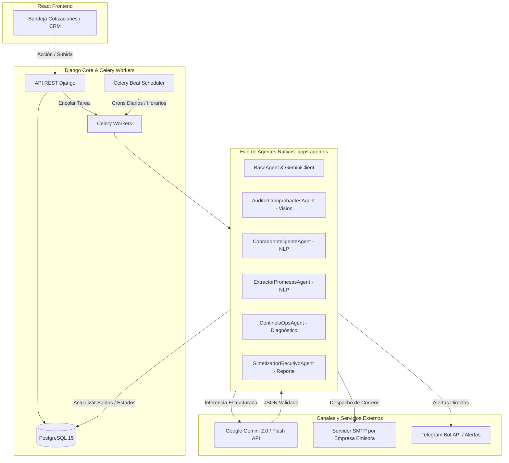
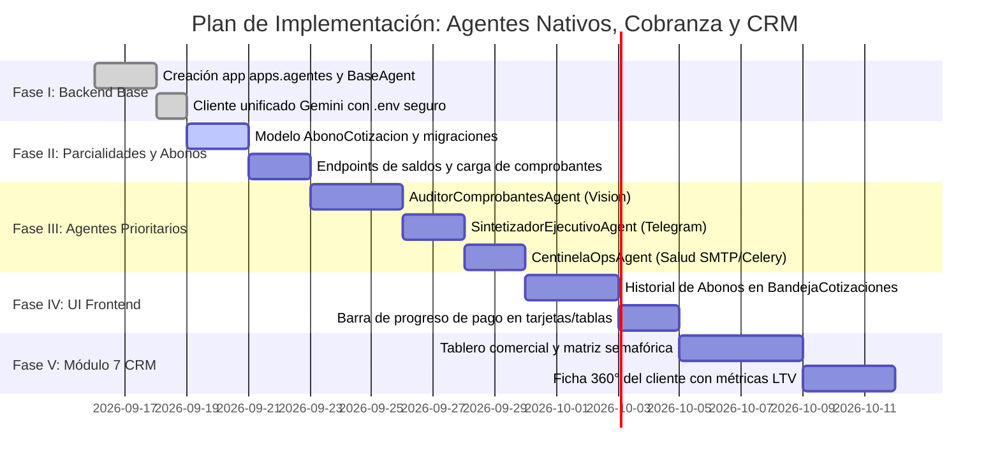

# Arquitectura de Agentes Nativos (Django + Celery + Gemini), Cobranza Inteligente y CRM Comercial

**Fecha de Actualización:** 2026-09-15  
**Estado:** Documento de Arquitectura Aprobado para Futuras Implementaciones  
**Enfoque:** Agentes Especialistas Nativos en Python (Sin n8n ni Frameworks Multiagente Conversacionales)  

---

## 1. Justificación de la Decisión Arquitectónica (Trade-Offs)

Durante el diseño inicial se evaluaron herramientas externas de automatización (como **n8n**) y frameworks multiagente conversacionales (como **CrewAI** o **AutoGen**). Tras una auditoría técnica profunda del stack existente y los requerimientos del sistema, **ambas opciones fueron descartadas en favor de un Hub de Agentes Nativos en Django (`backend/apps/agentes/`)**:

### A. ¿Por qué se descartó n8n?
1. **Sobrecarga de Infraestructura:** n8n requiere un contenedor Node.js permanente (500 MB – 1 GB de RAM), base de datos interna y mantenimiento adicional en el servidor.
2. **"Split Brain" de Lógica de Negocio:** Dividiría las reglas financieras (saldos, abonos, cotizaciones) entre diagramas visuales en n8n y modelos en Django/PostgreSQL.
3. **Seguridad y Control de Secretos:** Dificulta el cumplimiento de la política de cero credenciales expuestas en Git, al almacenar API keys en su propia base de datos.
4. **Duplicidad:** El stack ya cuenta con **Celery**, **Celery Beat**, **Redis** y **PostgreSQL**. Cualquier cron, webhook o llamada HTTP se resuelve nativamente en Python con mayor velocidad, menor latencia y trazabilidad en Git.

### B. ¿Por qué se descartaron los Multiagentes Conversacionales?
1. **Falta de Determinismo en Finanzas:** En facturación, montos y conciliación bancaria se exige exactitud matemática. Poner a deliberar a varios LLMs entre sí genera riesgo de alucinación en cascada y resultados no reproducibles.
2. **Latencia Excesiva:** Cada interacción entre agentes toma de 2 a 6 segundos. Un flujo multiagente conversacional promedia entre 20 y 40 segundos, frente a los **30 milisegundos** de un pipeline determinista en Python.
3. **Costo de Inferencia:** Multiplica el consumo de tokens innecesariamente al recircular contextos entre agentes.
4. **Imposibilidad de Testing Unitario:** No es viable aplicar pruebas automatizadas (`pytest`) con aserciones estrictas sobre diálogos estocásticos entre agentes.

> [!TIP]
> **Patrón Arquitectónico Adoptado:** **Agentes Especialistas Monotarea Orquestados por Código Determinista**.  
> El "cerebro" orquestador y las reglas de negocio son código Python en Django y Celery. La Inteligencia Artificial (Gemini) actúa exclusivamente como motor de percepción (visión de comprobantes) y redacción contextual (mensajes empáticos), retornando siempre **JSON Estructurado con validación de esquema estricta (`response_schema`)**.

---

## 2. Arquitectura Global del Sistema



---

## 3. Módulo Cotizador: Pagos por Parcialidades y Abonos

Para soportar cotizaciones que se liquidan en dos o más exhibiciones sin recurrir a hojas de cálculo externas, se extenderá el esquema de datos en Django.

### A. Modelo `AbonoCotizacion` (`backend/apps/cotizador/models.py`)
```python
from django.db import models

class AbonoCotizacion(models.Model):
    cotizacion = models.ForeignKey(
        'OperacionFacturacion', 
        on_delete=models.CASCADE, 
        related_name='abonos'
    )
    monto_abonado = models.DecimalField(max_digits=12, decimal_places=2)
    fecha_pago = models.DateTimeField()
    banco_origen = models.CharField(max_length=100, blank=True, null=True)
    cuenta_destino = models.CharField(max_length=50, blank=True, null=True)
    clave_rastreo_spei = models.CharField(max_length=100, blank=True, null=True)
    comprobante_archivo = models.FileField(upload_to='comprobantes_abonos/%Y/%m/')
    
    class EstatusValidacion(models.TextChoices):
        VERIFICADO = 'VERIFICADO', 'Verificado por IA y Conciliado'
        EN_REVISION = 'EN_REVISION', 'En Revisión Manual'
        RECHAZADO = 'RECHAZADO', 'Sospechoso o No Válido'

    estatus_validacion = models.CharField(
        max_length=20, 
        choices=EstatusValidacion.choices, 
        default=EstatusValidacion.VERIFICADO
    )
    saldo_restante = models.DecimalField(max_digits=12, decimal_places=2)
    observaciones_ia = models.TextField(blank=True, null=True)
    creado_el = models.DateTimeField(auto_now_add=True)

    class Meta:
        verbose_name = 'Abono de Cotización'
        verbose_name_plural = 'Abonos de Cotizaciones'
        ordering = ['-fecha_pago']
```

### B. Extensiones en el Modelo de Cotización
* `monto_cobrado`: Acumulado calculado de abonos validados.
* `saldo_pendiente`: `monto_total - monto_cobrado`.
* `fecha_promesa_pago`: Fecha compromiso extraída del seguimiento con el cliente.
* **Flujo de Estados de Cobranza:**
  1. `Enviada (Pendiente de Pago)` (0% cobrado).
  2. `Parcialmente Pagada` (Abonos registrados con saldo pendiente > 0).
  3. `Liquidada al 100%` (Saldo = 0, habilitada para emisión y timbrado CFDI).

---

## 4. Los 5 Agentes Especialistas Nativos (`backend/apps/agentes/`)

### Estructura de Archivos Propuesta:
```
backend/apps/agentes/
├── __init__.py
├── apps.py
├── core/
│   ├── __init__.py
│   ├── base_agent.py          # Clase abstracta con gestión de tokens y reintentos
│   └── gemini_client.py       # Cliente unificado con clave desde .env
├── auditor_comprobantes.py    # Agente de Visión (Auditoría Anti-Fraude)
├── cobrador_inteligente.py    # Agente de Redacción Contextual de Cobranza
├── extractor_promesas.py      # Agente NLP para Detección de Compromisos de Pago
├── centinela_ops.py           # Agente de Salud de Infraestructura (SMTP/Celery)
├── sintetizador_ejecutivo.py  # Agente Matutino de Reporte a Telegram
└── tasks.py                   # Orquestación asíncrona Celery
```

---

### Detalle de cada Agente:

#### 1. `AuditorComprobantesAgent` (Auditor Anti-Fraude de Transferencias)
* **Disparador:** El cliente o el asesor sube un comprobante (PNG, JPG, PDF) a una cotización en la bandeja.
* **Capacidad IA:** Gemini Vision analiza la imagen contra un `response_schema` estricto en JSON:
  ```json
  {
    "banco_emisor": "BBVA",
    "cuenta_beneficiaria_clabe": "012180001234567890",
    "monto_detectado": 25400.00,
    "fecha_transferencia": "2026-09-15 14:32:00",
    "clave_rastreo": "202609154001404100",
    "estatus_operacion": "EXITOSA",
    "es_transferencia_programada": false,
    "sospecha_alteracion": false
  }
  ```
* **Lógica Determinista en Python:**
  - Compara la `cuenta_beneficiaria_clabe` con la CLABE registrada en la `EmpresaEmisora` de la cotización.
  - Si `es_transferencia_programada == True` o el estatus no es en firme, marca el abono en `EN_REVISION` y bloquea el avance a timbrado.
  - Si los datos son consistentes, crea el registro `AbonoCotizacion`, descuenta el saldo y actualiza el estado de la cotización.

#### 2. `CobradorInteligenteAgent` (Cobranza Empática y Contextual)
* **Disparador:** Tarea nocturna de Celery Beat que detecta cotizaciones pendientes de pago próximas a vencer o con retraso.
* **Capacidad IA:** Redacta un correo personalizado analizando el historial del cliente, evitando mensajes genéricos agresivos:
  - **Fase Preventiva (2 días antes):** Recordatorio de cortesía con el desglose de importes y datos de cuenta para su programación bancaria semanal.
  - **Fase Vencida (3 a 5 días de retraso):** Tono colaborativo, consultando si requieren apoyo con aclaraciones operativas o fecha tentativa.
  - **Fase Crítica (+10 días):** Tono formal y ejecutivo, señalando la reprogramación de servicios o congelamiento de entregas.
* **Lógica Determinista en Python:** Genera el borrador o realiza el envío mediante `enviar_cotizacion_task` utilizando el servidor SMTP oficial de la empresa emisora correspondiente.

#### 3. `ExtractorPromesasAgent` (Detector de Fechas de Compromiso)
* **Disparador:** Lectura de correos entrantes del cliente o registro de notas por el asesor.
* **Capacidad IA:** Identifica expresiones temporales en lenguaje natural (*"te liquido la mitad el próximo viernes 19"*, *"queda a fin de quincena"*).
* **Lógica Determinista en Python:**
  - Extrae la fecha exacta en formato `YYYY-MM-DD`.
  - Actualiza `fecha_promesa_pago` en la base de datos PostgreSQL.
  - **Reprograma automáticamente las alarmas de cobranza**, evitando enviar correos automáticos al cliente antes de la fecha acordada.

#### 4. `CentinelaOpsAgent` (Diagnóstico de Salud de Infraestructura)
* **Disparador:** Cron cada hora en Celery Beat o cuando una tarea de correo lanza 2 reintentos fallidos (`MaxRetriesExceeded`).
* **Lógica Determinista en Python:**
  - Abre conexiones de prueba `socket` y `SMTP_SSL` a los hosts configurados en `EmpresaEmisora` (cPanel / Web Hosting).
  - Consulta la longitud de la cola en Redis y la conectividad a PostgreSQL.
* **Capacidad IA:** Si hay un error técnico complejo (ej. respuesta `550 Relay access denied` o bloqueo SPF/DKIM), el agente traduce el log técnico a un reporte ejecutivo en español claro.
* **Salida:** Despacho de alerta directa al Telegram del administrador.

#### 5. `SintetizadorEjecutivoAgent` (Reporte Matutino de Cartera)
* **Disparador:** Cron diario a las 8:30 AM en Celery Beat.
* **Lógica Determinista en Python:** Extrae agregaciones SQL de PostgreSQL:
  - Saldo total pendiente de cobro por empresa emisora.
  - Cobros registrados y validados en las últimas 24 horas.
  - Lista de cotizaciones con promesas de pago para el día en curso.
  - Clientes con más de 7 días de morosidad.
* **Capacidad IA:** Condensa los datos numéricos en un mensaje ejecutivo de 4 párrafos optimizado para lectura en Smartphones.
* **Salida:** Envío vía Telegram Bot API al canal de Dirección y Finanzas.

---

## 5. Módulo 7: Tablero CRM y Salud del Cliente

Este componente transformará el catálogo existente de clientes en un motor comercial analítico en tiempo real sin requerir software externo.

### A. Métricas 360° por Cliente (Calculadas en PostgreSQL)
* **LTV (Customer Lifetime Value):** Suma acumulada histórica de todas las cotizaciones liquidadas y facturadas.
* **Frecuencia y Días de Inactividad:** Días transcurridos desde la última compra o cotización solicitada.
* **Tasa de Cierre (% Conversion):** Razón entre cotizaciones solicitadas vs cotizaciones efectivamente pagadas.
* **Ticket Promedio:** Importe medio por transacción cerrada.

### B. Matriz de Segmentación Comercial (Semáforo de Salud)

| Estatus | Regla Operativa | Acción Automatizada con Agente Nativo |
|---|---|---|
| 🟢 **Cliente Activo** | Compra en los últimos 30 días. | Mantener en ciclo regular y notificar actualizaciones de catálogo. |
| 🟡 **En Riesgo** | Entre 31 y 60 días sin actividad. | Tarea en Celery para sugerir al asesor una llamada de seguimiento comercial. |
| 🔴 **Dormido / Inactivo** | Más de 60 días sin cotizar ni comprar. | Propuesta de correo de reactivación personalizada generada por IA. |
| ⚪ **Prospecto Frío** | Registrado en catálogo con 0 cotizaciones ganadas. | Secuencia de contacto inicial y presentación de servicios. |

### C. Flujo de Reactivación Comercial Controlado
1. Celery Beat identifica clientes que cambian de semáforo verde a amarillo (30 días de inactividad).
2. El agente `CobradorInteligenteAgent` genera una sugerencia de mensaje adaptado al historial de lo que el cliente suele comprar.
3. **Control Humano en React:** La propuesta aparece en una tarjeta de la vista comercial para que el asesor la revise y la despache en 1-clic, evitando envíos automáticos no supervisados.

---

## 6. Hoja de Ruta de Implementación Técnica



---

## 7. Enlaces Relacionados (Obsidian Second Brain)

- [[Walkthrough_UI_UX_Cotizador]]
- [[2026-08-25_Walkthrough_Arquitectura_de_Cotización_Facturación]]
- [[2026-08-28_Walkthrough_Bandejas_Historial_y_Clientes]]
- [[2026-09-07_Walkthrough_Catalogo_Relacional_Conceptos]]
- [[2026-09-14_Walkthrough_Correccion_Vista_Previa_PDF_Bandeja]]
