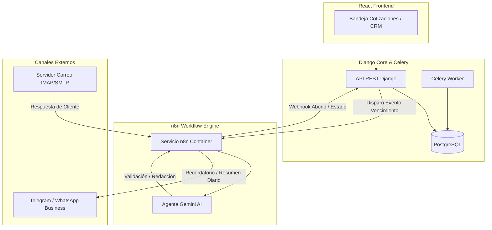

# Integración de n8n, Cobranza Inteligente con IA y CRM Comercial

**Fecha de Creación:** 2026-09-11  
**Estado:** Propuesta de Arquitectura e Implementación Futura  
**Módulos Afectados:** Módulo 5 (Cotizador y Facturación) y Módulo 7 (CRM Comercial)  
**Tecnologías Involucradas:** n8n (Docker), Django REST Framework, Celery, PostgreSQL, Gemini Vision/AI, React (Vite).

---

## 1. Visión General y Objetivos

Este documento especifica la arquitectura y diseño técnico para transformar el **Módulo de Cotizador** en un ecosistema integral de **Cobranza Inteligente y CRM Comercial**, utilizando **n8n** como orquestador de flujos automatizados e **Inteligencia Artificial (Gemini)** como motor analítico y de redacción.

### Objetivos Clave:
1. **Control de Abonos y Parcialidades:** Gestionar cotizaciones que se liquidan en múltiples exhibiciones, con historial de pagos y saldos en tiempo real.
2. **Auditoría IA Anti-Fraude de Comprobantes:** Detectar automáticamente transferencias reales (*Liquidadas*) vs comprobantes *En proceso*, *Programados* o manipulados.
3. **Cobranza Proactiva y Empática:** Automatizar recordatorios personalizados adaptando el tono según el cliente y días de vencimiento.
4. **Detección de Promesas de Pago:** Extraer fechas prometidas de las respuestas de los clientes para reprogramar alarmas sin intervención humana.
5. **CRM y Salud del Cliente (Módulo 7):** Segmentar automáticamente los 162 clientes de la base de datos (Activos, En Riesgo, Dormidos, Prospectos) e impulsar su reactivación.

---

## 2. Arquitectura de Integración con n8n

n8n se integrará como un microservicio autónomo en la red Docker del sistema (`sig_network`), comunicándose con Django mediante Webhooks bidireccionales y endpoints seguros protegidos con API Key.



### Configuración en `docker-compose.yml`:
```yaml
  sig_n8n:
    image: docker.n8n.io/n8nio/n8n:latest
    container_name: sig_n8n
    restart: unless-stopped
    ports:
      - "5678:5678"
    environment:
      - N8N_HOST=localhost
      - N8N_PORT=5678
      - N8N_PROTOCOL=http
      - NODE_ENV=production
      - WEBHOOK_URL=http://localhost:5678/
      - GENERIC_TIMEZONE=America/Mexico_City
    volumes:
      - n8n_data:/home/node/.n8n
    networks:
      - sig_network
```

---

## 3. Módulo Cotizador: Pagos por Parcialidades y Abonos

Para soportar cotizaciones que se liquidan en dos o más exhibiciones, se extenderá el esquema relacional en Django.

### A. Modelo `AbonoCotizacion`
```python
class AbonoCotizacion(models.Model):
    cotizacion = models.ForeignKey('Cotizacion', on_delete=models.CASCADE, related_name='abonos')
    monto_abonado = models.DecimalField(max_digits=12, decimal_places=2)
    fecha_pago = models.DateTimeField()
    banco_origen = models.CharField(max_length=100, blank=True, null=True)
    cuenta_destino = models.CharField(max_length=50, blank=True, null=True)
    clave_rastreo_spei = models.CharField(max_length=100, blank=True, null=True)
    comprobante_archivo = models.FileField(upload_to='comprobantes_abonos/%Y/%m/')
    
    ESTATUS_VALIDACION = [
        ('VERIFICADO', 'Verificado por IA y Conciliado'),
        ('EN_REVISION', 'En Revisión Manual'),
        ('RECHAZADO', 'Sospechoso o No Válido')
    ]
    estatus_validacion = models.CharField(max_length=20, choices=ESTATUS_VALIDACION, default='VERIFICADO')
    saldo_restante = models.DecimalField(max_digits=12, decimal_places=2)
    creado_el = models.DateTimeField(auto_now_add=True)
```

### B. Extensiones en el Modelo `Cotizacion`
* `monto_cobrado`: Acumulado de abonos recibidos.
* `saldo_pendiente`: `monto_total - monto_cobrado`.
* `fecha_promesa_pago`: Fecha compromiso extraída de la comunicación con el cliente.
* **Flujo de Estados de Pago:**
  1. `Enviada (Esperando Pago)` (0% cobrado)
  2. `Parcialmente Pagada` (Abono registrado, saldo pendiente > 0)
  3. `Liquidada al 100%` (Saldo = 0, lista para emisión y timbrado de Factura CFDI)

---

## 4. Capacidades de Inteligencia Artificial (Gemini + n8n)

### 1. Auditor Anti-Fraude de Comprobantes Bancarios
* **Problema:** Clientes que envían comprobantes en estatus "En Proceso", transferencias programadas para días posteriores, imágenes recortadas o comprobantes de otros bancos.
* **Solución IA:** Gemini Vision procesa el archivo adjunto y evalúa:
  * Estatus de la transacción (*"Exitosa / Liquidada"* vs *"Programada / En proceso"*).
  * Validación de coincidencia de la cuenta CLABE receptora con la de la Empresa Emisora de la cotización.
  * Extracción de clave de rastreo SPEI para comprobación en Banxico si se requiere.
* **Respuesta:** Si el comprobante no está en firme, n8n alerta al equipo comercial y bloquea el avance automático a factura.

### 2. Redacción Inteligente de Cobranza (Cobranza Empática)
En lugar de plantillas estáticas y agresivas, un nodo de IA en n8n redacta el mensaje adaptando el tono al historial del cliente:
* **Fase Preventiva (2 días antes del vencimiento):** Tono de servicio y agradecimiento, compartiendo el desglose de la cotización para su programación semanal.
* **Fase Vencida (3 a 5 días de retraso):** Tono cordial y colaborativo, consultando si requieren apoyo con datos de facturación o fecha estimada.
* **Fase Crítica (+10 días):** Tono ejecutivo y formal, informando sobre la reprogramación de entregas o retención de timbrado.

### 3. Detector de Promesas de Pago en Respuestas
* n8n analiza el cuerpo de los correos entrantes de los clientes cuando responden al hilo de la cotización.
* Si el texto contiene expresiones como: *"Te deposito la mitad el próximo viernes"* o *"El 15 queda listo"*:
  * La IA extrae la fecha exacta en formato `YYYY-MM-DD`.
  * Llama al endpoint de Django `PATCH /api/cotizador/cotizaciones/{id}/promesa_pago/`.
  * Actualiza la base de datos y **reprograma la alarma de cobranza** para el día siguiente a la fecha prometida, evitando molestar al cliente prematuramente.

### 4. Resumen Ejecutivo Matutino de Cartera
* Cron diario a las 8:30 AM ejecutado por n8n.
* Consulta la API de Django y genera un reporte conciso enviado al canal de Dirección (Telegram / WhatsApp):
  * Saldo total por cobrar.
  * Clientes con pagos prometidos para hoy.
  * Clientes en riesgo con más de 7 días de vencimiento.
  * Total de ingresos cobrados el día anterior.

---

## 5. Módulo 7: Tablero CRM y Salud del Cliente

Este componente transformará el catálogo de clientes en un motor comercial analítico sin necesidad de contratar herramientas externas (HubSpot, Salesforce).

### A. Métricas 360° por Cliente
Para cada uno de los 162 clientes se calculará en tiempo real:
* **LTV (Customer Lifetime Value):** Suma histórica total de facturas timbradas y pagadas.
* **Frecuencia y Días sin Compra:** Fecha de la última compra y cálculo de días transcurridos.
* **Tasa de Cierre:** Porcentaje de cotizaciones que se convirtieron en compras reales.
* **Ticket Promedio:** Gasto medio por transacción.

### B. Matriz de Segmentación (Semáforo de Salud)

| Estatus | Regla de Negocio | Acción Automatizada con n8n |
| :--- | :--- | :--- |
| 🟢 **Cliente Activo** | Compra en los últimos 30 días. | Mantenimiento y envío de novedades del catálogo. |
| 🟡 **En Riesgo** | Entre 31 y 60 días sin actividad. | Alerta a ventas para llamada de seguimiento o cortesía. |
| 🔴 **Dormido / Inactivo** | Más de 60 días sin cotizar ni comprar. | Campaña automatizada con IA para reactivación comercial. |
| ⚪ **Prospecto Frío** | Registrado en catálogo con 0 compras. | Secuencia de presentación de servicios y contacto inicial. |

### C. Flujo de Reactivación Comercial Autónoma
1. n8n detecta clientes habituales que pasan a semáforo amarillo (30 días de inactividad).
2. Genera una propuesta de saludo personalizada con Gemini:  
   *"Hola [Contacto], tiene tiempo que no sabemos de ustedes en [Empresa]. ¿Tienen algún requerimiento o proyecto en puerta en el que podamos colaborar?"*
3. Presenta la lista sugerida al asesor en la interfaz de React para autorización en 1-Clic antes de enviar.

---

## 6. Hoja de Ruta para su Implementación

1. **Fase I (Infraestructura):** Levantar el contenedor `sig_n8n` en `docker-compose.yml` y vincularlo a `sig_network`.
2. **Fase II (Backend de Abonos):** Crear modelo `AbonoCotizacion`, migraciones en Django y endpoints de saldos y promesas de pago.
3. **Fase III (Workflows n8n + Gemini):**
   * Flujo de lectura de comprobantes y validación anti-fraude.
   * Flujo de cobranza empática y promesas de pago.
   * Flujo de reporte ejecutivo matutino.
4. **Fase IV (Frontend Cotizador):** Incorporar barra de progreso de pago e historial de abonos en `BandejaCotizaciones.jsx`.
5. **Fase V (Módulo 7 CRM):** Desarrollar la vista comercial con la matriz de segmentación y ficha 360° del cliente.
