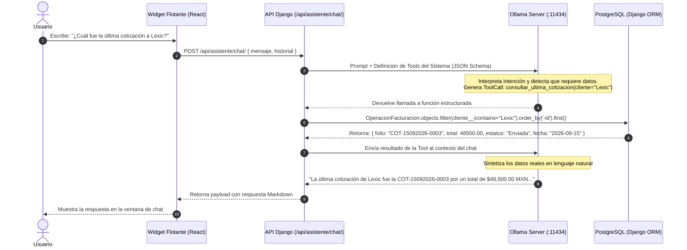
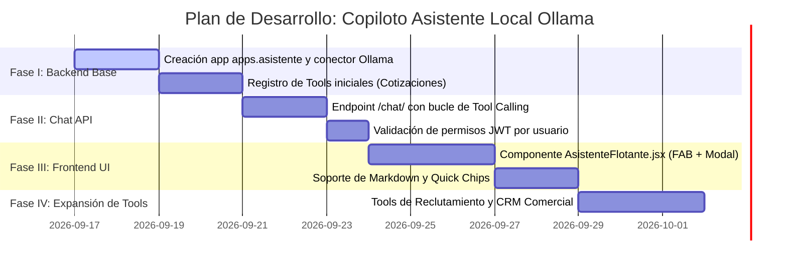

# Copiloto Asistente Local (Ollama) con Chat Flotante para el Sistema Integral de Gestión

**Fecha de Creación:** 2026-09-15  
**Estado:** Propuesta de Arquitectura e Implementación Futura  
**Módulo Destino:** Asistente Conversacional Omnipresente (Frontend Flotante + Backend Tool Calling con Ollama)  

---

## 1. Visión y Objetivos

Transformar el Sistema Integral de Gestión (SIG) en un **ERP Inteligente Asistido por IA**, permitiendo a directores, supervisores y operadores consultar métricas, buscar registros y verificar estados operativos mediante lenguaje natural sin necesidad de navegar manualmente entre pestañas, filtros o formularios.

### Casos de Uso Principales:
- **Cotizaciones y Facturación:**  
  - *"¿Cuál fue la última cotización enviada a Lexic y por qué monto?"*  
  - *"¿Cuántas cotizaciones tenemos en estatus Por Enviar el día de hoy?"*  
  - *"¿Cuál es el saldo total pendiente de cobro de Berzan?"*
- **Directorio y Clientes:**  
  - *"¿Tenemos registrado el correo fiscal de Grupo Bimbo?"*  
  - *"Lista las empresas emisoras que tienen configurado SMTP activo."*
- **Reclutamiento y ATS:**  
  - *"¿Cuántas vacantes tenemos abiertas actualmente?"*  
  - *"¿Cuántos candidatos en proceso hay para la vacante de Desarrollador Python?"*
- **Atajos Operativos:**  
  - *"Llévame a la bandeja de aprobación de facturas Monterrey."*

---

## 2. Justificación Técnica de Ollama Local (Privacidad y Cero Costo)

La adopción de **Ollama** como motor de inferencia local responde a los siguientes pilares de ingeniería:

1. **Privacidad Total de Información Sensible (On-Premises):**  
   Los datos financieros, cotizaciones de clientes, saldos por cobrar y expedientes de candidatos **nunca salen del servidor ni viajan a servicios de terceros**.
2. **Cero Costo por Token:**  
   No hay cargos de API ni cuotas mensuales; los usuarios pueden interactuar ilimitadamente con el asistente.
3. **Soporte Nativo de Tool Calling (Function Calling):**  
   Modelos locales modernos como `qwen2.5:7b`, `llama3.1:8b` o `mistral` cuentan con soporte nativo para ejecutar herramientas estructuradas, lo que permite conectar el LLM con el ORM de Django con alta precisión.

---

## 3. Arquitectura del Sistema (Patrón Tool Calling)

El modelo de lenguaje **no consulta la base de datos directamente ni alucina cifras**. Funciona como un agente de interpretación de intenciones que solicita al backend de Django la ejecución de herramientas deterministas de **solo lectura**.



---

## 4. Catálogo Inicial de Herramientas del Asistente (Tools)

Cada herramienta se implementa como una función de Python de solo lectura protegida con tipado estricto:

| Nombre de la Herramienta | Parámetros | Descripción / Consulta ORM |
|---|---|---|
| `consultar_ultima_cotizacion` | `cliente_nombre` (opcional) | Recupera la cotización más reciente generada en el sistema, con folio, fecha, monto total y estado. |
| `contar_cotizaciones_por_estado` | `estado` (`por_enviar`, `enviadas`) | Cuenta la cantidad de registros en cada sub-pestaña de la bandeja. |
| `buscar_cliente_directorio` | `query` (nombre o empresa) | Busca clientes en la base de datos y retorna su correo registrado y tipo (`CATALOGO` vs `OPERACION_UNICA`). |
| `resumen_ventas_periodo` | `dias` (por defecto 30) | Suma acumulada de importes cotizados y promedio de ticket. |
| `consultar_vacantes_activas` | Ninguno | Retorna el total de vacantes en estatus abierta en el módulo de Reclutamiento. |
| `listar_empresas_emisoras` | Ninguno | Retorna las razones sociales de empresas emisoras configuradas para emisión de cotizaciones. |

> [!CAUTION]
> **Seguridad Estricta de Datos (Solo Lectura):**  
> El asistente **bajo ninguna circunstancia** tendrá herramientas de mutación (crear cotizaciones, borrar registros o alterar contraseñas). Todas las funciones del asistente son queries SQL de solo lectura (`SELECT`).

---

## 5. Especificación de la Interfaz de Usuario (Frontend React)

El componente del asistente se renderizará de forma global en `App.jsx`, manteniéndose accesible desde cualquier vista del sistema sin obstruir el contenido principal.

### A. Botón Flotante (Floating Action Button - FAB)
- **Ubicación:** `position: fixed; bottom: 24px; right: 24px; z-index: 1000`.
- **Estilo Visual:** Botón circular con degradado Violeta Orquídea (`#C084FC` a `#9333EA`), sombra elevada (`box-shadow: 0 10px 25px rgba(147, 51, 234, 0.3)`) y micro-animación de pulso cuando está inactivo.
- **Iconografía:** Icono `Sparkles` o `BotMessageSquare` de `lucide-react` (sin emojis).

### B. Ventana de Chat Flotante
- **Dimensiones:** Ancho de `380px`, alto de `560px` (adaptable en móviles a pantalla completa tipo drawer).
- **Diseño Glassmorphism / Fintech:** Encabezado con título del asistente, indicador de estado de conexión con Ollama (punto verde/rojo) y botón de minimizar/cerrar.
- **Chips de Preguntas Rápidas (Quick Starters):**
  - *"Última cotización enviada"*
  - *"Cotizaciones por enviar"*
  - *"Vacantes de reclutamiento abiertas"*
  - *"Resumen del mes"*
- **Renderizado Markdown:** Respuestas formateadas con negritas, tablas de importes y enlaces de navegación directa dentro del sistema.

---

## 6. Especificación del Backend (Django)

### Estructura Propuesta:
```
backend/apps/asistente/
├── __init__.py
├── apps.py
├── urls.py
├── views.py                  # Endpoint POST /api/asistente/chat/
├── services/
│   ├── ollama_client.py     # Cliente HTTP hacia localhost:11434 con reintentos
│   ├── tools_registry.py    # Definición de JSON Schemas de las Tools
│   └── tools_executor.py    # Ejecución de consultas ORM de solo lectura
└── serializers.py           # Validación de mensajes entrantes
```

### Configuración en `settings/base.py`:
```python
# Conexión local a Ollama
OLLAMA_HOST = config('OLLAMA_HOST', default='http://host.docker.internal:11434')
OLLAMA_MODEL = config('OLLAMA_MODEL', default='qwen2.5:7b')
```
*(Se utiliza `host.docker.internal` para que el contenedor de Django pueda comunicarse con el servicio de Ollama que corre en el host Windows/WSL).*

---

## 7. Plan de Implementación por Fases



---

## 8. Enlaces Relacionados (Obsidian Second Brain)

- [[2026-09-11_Integracion_n8n_Cobranza_Inteligente_y_CRM_Comercial]]
- [[Walkthrough_UI_UX_Cotizador]]
- [[2026-08-25_Walkthrough_Arquitectura_de_Cotización_Facturación]]
- [[2026-08-28_Walkthrough_Bandejas_Historial_y_Clientes]]
