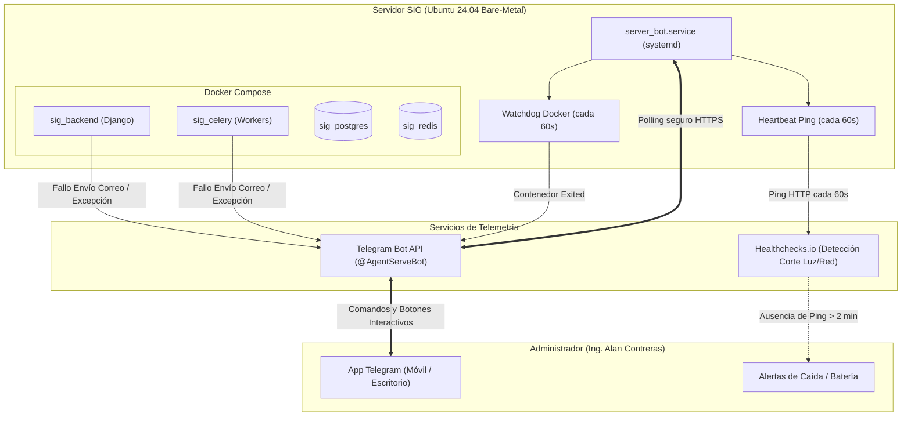

# Manual de Telemetría con Telegram y Gestión Segura de Secretos (.env)

> [!NOTE]
> Este documento técnico forma parte del Segundo Cerebro en Obsidian. Detalla la arquitectura de monitoreo remoto del Servidor SIG (Ubuntu Bare-Metal `192.168.10.46`), la red de alertas en tiempo real vía Telegram (`@AgentServeBot`), la detección de cortes de energía mediante Healthchecks.io y la política estricta de gestión de secretos y variables de entorno entre los entornos de Desarrollo y Producción.

---

## 1. Arquitectura de Monitoreo y Control Remoto

El servidor opera de forma autónoma en la red local física sin requerir software cliente en los equipos de los usuarios ni servicios externos de pago.



---

## 2. Bot de Operaciones Remotas (@AgentServeBot)

El bot está implementado en `/home/sistemas/server_bot.py` y se ejecuta como un servicio del sistema gestionado por `systemd` (`server_bot.service`), arrancando automáticamente junto con el servidor.

### 2.1. Panel de Botones Interactivos
Al enviar cualquier mensaje o iniciar con `/menu`, el teclado permanente del bot despliega los siguientes accesos directos:

| Botón | Comando Interno | Acción y Resultado |
| :--- | :--- | :--- |
| **📊 Estado del Servidor** | `/status` | Muestra uso de RAM (`free -h`), disco SSD (`df -h`), carga de CPU (1, 5 y 15 min), temperatura del procesador y lista de contenedores Docker activos. |
| **📍 Ver IP** | `/ip` | Consulta la IP pública dinámica actual del módem y la IP local (`192.168.10.46`) con enlace directo a la web. |
| **📥 Actualizar Sistema (Git Pull)** | `/actualizar` | Ejecuta `git pull` en el repositorio, muestra el hash del commit descargado y corre automáticamente `docker exec sig_backend python manage.py migrate`. |
| **⚠️ Ver Errores / Logs** | `/errores` | Examina los últimos 60 registros de `sig_backend` y `sig_celery`, extrayendo únicamente las excepciones (`Traceback`, `ERROR`, `CRITICAL`). |
| **🔄 Reiniciar Docker** | `/restart_docker` | Ejecuta `docker compose restart` para recargar todos los contenedores sin reiniciar el hardware físico. |
| **⚡ Reiniciar Servidor** | `/reboot` | Solicita confirmación de dos pasos (`SI, REINICIAR AHORA` / `CANCELAR`). Si se confirma, lanza `sudo reboot` y notifica al volver a encender. |
| **🛑 Apagar Servidor** | `/apagar` | Solicita confirmación de dos pasos. Envía un ping de fallo ordenado a Healthchecks.io y ejecuta `sudo shutdown -h now`. |

### 2.2. Vigilante de Contenedores en Segundo Plano (Watchdog)
El bot incorpora un hilo en segundo plano que evalúa cada 60 segundos si algún contenedor con prefijo `sig_` se encuentra en estado `Exited`:
- Si detecta un contenedor detenido, despacha una alerta inmediata con el nombre del servicio afectado para que el administrador pueda reiniciarlo desde el chat.

### 2.3. Vigilante de Corte de Energía / Caída de Internet (Healthchecks.io)
El servidor envía un pulso HTTP cada minuto al endpoint:
`https://hc-ping.com/f8464d9c-abf0-4ba1-8beb-44da1fb6c080`
- Si el servidor físico se apaga por corte eléctrico o el módem pierde conexión, los pulsos se interrumpen.
- Tras 2 minutos de silencio, Healthchecks.io notifica automáticamente al administrador informando que el equipo está fuera de línea.

---

## 3. Detección y Alerta de Fallos en Envío de Correos

Las operaciones críticas del Cotizador y Facturación envían comprobantes, cotizaciones y facturas oficiales a través de tareas asíncronas de Celery (`backend/apps/cotizador/tasks.py`):
- `enviar_cotizacion_task`
- `enviar_factura_oficial_task`
- `enviar_prefactura_monterrey_task`

### 3.1. Flujo de Intercepción
Si el servidor SMTP del cliente o emisor rechaza el mensaje (dirección inexistente `550`, buzón lleno, timeout o contraseña SMTP expirada):

1. El bloque `try/except` de la tarea intercepta la excepción en Celery.
2. Invoca el módulo `backend/core/telegram.py` mediante la función `notificar_error_correo()`.
3. Dispara un mensaje directo a Telegram con el reporte estructurado:

```text
🚨 ERROR EN ENVÍO DE CORREO

📄 Documento: Cotización (COT-2026-0042)
👤 Cliente: Transportes del Norte
📧 Destinatario: facturacion@clientenoexiste.com
⏰ Hora: 17:45:10

❌ Causa del Error:
SMTPRecipientsRefused: 550 Mailbox does not exist
```

---

## 4. Gestión Segura de Secretos y Variables de Entorno (.env)

> [!IMPORTANT]
> **Regla de Oro en Arquitectura de Software:**  
> El código fuente (`.py`, `.jsx`, `.json`) se versiona en Git. Las contraseñas, tokens y credenciales privadas **NUNCA** deben ingresar al historial de Git.

### 4.1. Por qué `.env` NO pasa por Git
1. **Seguridad y Prevención de Fugas:** Si un token o contraseña se sube a un commit, cualquier persona con acceso al repositorio o escáneres automatizados de seguridad (como GitHub Secret Scanning) lo detectarán de inmediato.
2. **Independencia de Entornos:**
   - **PC de Desarrollo:** Requiere `DEBUG=True`, servicios apuntando a `localhost`, y tokens de pruebas.
   - **Servidor de Producción:** Opera con `DEBUG=False`, IPs locales fijas (`192.168.10.46`), y credenciales de producción.

### 4.2. El Archivo `.env.example` como Plantilla
Para saber qué variables necesita el sistema sin exponer valores reales, se versiona en Git el archivo `backend/.env.example`:

```bash
# Archivo de muestra rastreado en Git (backend/.env.example)
SECRET_KEY=cambia-esto-por-una-clave-secreta-real
DEBUG=False
ALLOWED_HOSTS=localhost,127.0.0.1,192.168.10.46

TELEGRAM_BOT_TOKEN=
TELEGRAM_ADMIN_CHAT_ID=

EMAIL_HOST=mail.tudominio.com
EMAIL_PORT=465
EMAIL_HOST_USER=
EMAIL_HOST_PASSWORD=
```

### 4.3. Cómo Sincronizar Secretos entre PC y Servidor

Al agregar una nueva contraseña o token en el proyecto, existen dos métodos seguros para configurarla en el servidor sin pasar por internet:

#### Método A: Inyección Directa por SSH (Recomendado para 1 o 2 variables)
Conectado por SSH al servidor (`sistemas@servidor:~$`), se agregan las variables al `.env` local:
```bash
cat << 'EOF' >> ~/Sistema-Integral-de-Gestion/backend/.env

# --- Telegram Bot Telemetry ---
TELEGRAM_BOT_TOKEN=8945228048:AAFw0ywD7UeLEdO3_nm7Zm2qFm-tZoIWBcA
TELEGRAM_ADMIN_CHAT_ID=8759898291
EOF
```

#### Método B: Copia Encriptada por Red Local con `scp`
Desde la terminal PowerShell de la máquina de desarrollo, se transfiere el archivo directamente al servidor físico a través de la red local:
```powershell
# Transferencia directa encriptada punto a punto (sin tocar GitHub)
scp .\backend\.env sistemas@192.168.10.46:~/Sistema-Integral-de-Gestion/backend/.env
```

---

## 5. Mantenimiento y Comandos de Referencia

### 5.1. Reiniciar el Bot en el Servidor
```bash
sudo systemctl restart server_bot.service
sudo systemctl status server_bot.service
```

### 5.2. Ver Logs en Vivo del Bot
```bash
journalctl -u server_bot.service -f
```

### 5.3. Actualizar el Sistema Manualmente (Alternativa al Botón)
```bash
cd ~/Sistema-Integral-de-Gestion
git pull origin main
docker compose restart
```

---

## Enlaces Relacionados (Obsidian)
- [[2026-09-11_Despliegue_Servidor_Local_Ubuntu_BareMetal|Despliegue Servidor Local Ubuntu BareMetal]]
- [[2026-09-11_Manual_Flujo_Desarrollo_y_Despliegue_Servidor|Manual de Flujo de Desarrollo y Despliegue]]
- [[2026-09-11_Integracion_n8n_Cobranza_Inteligente_y_CRM_Comercial|Integración n8n y CRM]]
- [[MOC_Infraestructura_Servidor|MOC Infraestructura]]
